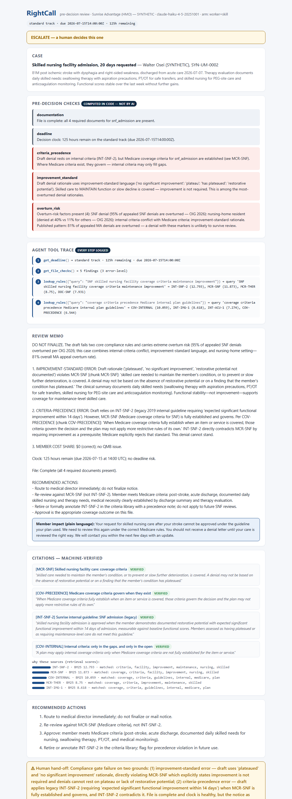
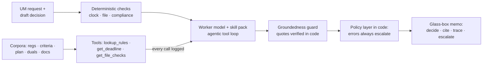

# RightCall — a glass-box pre-decision copilot for Medicare Advantage utilization management

**Catches the wrong denial before it exists. Deterministic code validates the file, runs the regulatory clock, and scores overturn risk; an auditable AI agent — every tool call logged — writes the review memo with machine-verified citations. High-risk decisions go to a human before any notice goes out.**

Built with Claude (`claude-fable-5` as teacher, `claude-haiku-4-5` as worker) · 100% Python standard library · MIT

---

## The problem

Medicare Advantage plans deny prior-authorization requests at roughly twice the rate of traditional Medicare — and when members appeal, [80.7% of denials are overturned](https://www.kff.org/medicare/medicare-advantage-insurers-deny-prior-authorization-requests-for-post-acute-care-at-substantially-higher-rates-than-the-overall-denial-rate/) (KFF). For skilled nursing facility care, a [2026 HHS OIG report](https://oig.hhs.gov/reports/all/2026/medicare-advantage-organizations-overturned-nearly-all-appealed-prior-authorization-denials-for-skilled-nursing-facility-admission-raising-concerns-about-initial-denials/) found **95% of appealed denials were overturned** — and nursing-home residents were denied at 40% vs 11% for everyone else.

An overturn rate that high is not an appeals story. It is a **first-time decision quality** problem: the information needed to make the right call — CMS regulations, coverage-criteria precedence, plan criteria, documentation requirements, dual-eligible protections, the decision clock — is fragmented across systems, and nothing checks the draft decision against all of it before the notice goes out. Every avoidable denial costs the plan an appeal, costs the provider a resubmission, and costs a member days of delayed care.

Meanwhile, AI is arriving on the *denial* side of this equation — opaquely. CMS's [WISeR model](https://www.kff.org/medicare/examining-the-potential-impact-of-medicares-new-wiser-model/) now pilots AI-assisted prior authorization in traditional Medicare, with vendors sharing in denial savings. RightCall is a demonstration of the opposite architecture: **AI on the quality side, with every step of its reasoning inspectable.**

## Why "glass box" — five engineering choices, not a metaphor

1. **The model never computes the facts.** Deterministic Python validates documentation completeness, runs the 72-hour/7-day decision clock, checks criteria precedence, QMB cost-sharing protections, improvement-standard language, and overturn-risk factors (`rightcall/checks.py`) — *before* the model sees the case.
2. **The agent's work is logged.** The model can only reach the rulebook, the clock, and the file checks by calling tools; every call is dispatched by code and recorded (`rightcall/tools.py`). The report's **tool trace** panel answers "how did the AI reach this memo?" step by step.
3. **Retrieval you can read.** BM25 over six human-readable corpora, with scores and matched terms in the output — and reachable only through the logged `lookup_rules` tool.
4. **Citations are enforced, not requested.** Every claim about a rule must name a chunk ID plus a verbatim quote, verified in code against the chunks the agent *actually retrieved in this review* (`rightcall/grounding.py`).
5. **The policy layer outranks the model.** If the memo endorses a denial while code found error-level compliance risk, code forces escalation to a human (`rightcall/pipeline.py`). The system can be wrong in only one direction: toward review.

## The teacher/worker economics (skill distillation)

Same bet as [ClearAnswer](https://github.com/musharraf3/clearanswer) (#2 in this series): the frontier model authors the expertise once — [`skills/um-predenial.md`](skills/um-predenial.md), a gated decision tree with domain invariants (criteria precedence, Jimmo maintenance coverage, QMB zero cost sharing) and worked exemplars — and a 10x-cheaper model executes it at runtime, now inside an agentic tool loop. The three-arm eval harness measures what that buys:

| Arm | Model | What it tests |
|---|---|---|
| `worker` | Haiku 4.5 + tools | baseline, no skill pack |
| `worker+skill` | Haiku 4.5 + tools + Fable 5's skill pack | the product configuration |
| `teacher+skill` | Fable 5 + tools | quality ceiling |

Decision accuracy is scored on the model's **raw** recommendation, before the code policy layer can rescue it — the policy layer exists to protect the member, not the metric. Results from live API runs are committed in [`evals/results.md`](evals/results.md).

**July 2026 run:** all three arms hit 100% raw decision accuracy — evidence that the *architecture* (deterministic checks + forced tool use) carries decision quality, not model size. Where the arms separate is discipline: escalation calibration went 8/10 (worker) → 9/10 (+skill) → 10/10 (teacher), groundedness 94% → 96% → 100%, and member-facing reading grade 9.1 → 8.1 → 6.8. The worker+skill configuration ran the whole suite for **$0.15 vs the teacher's $2.33** — a 16x measured gap. One honest wrinkle: skill pack v1.0 *hurt* the worker (it invented off-contract labels like "approval_of_draft" on correct-denial cases, which the code trapped and escalated); one clarifying paragraph in the skill fixed it. Authored expertise is code — it has bugs, and versioning it is the point.

## What a review looks like

`req_02` — the flagship planted defect: an SNF denial for a nursing-home resident, drafted on "plateaued" reasoning under a legacy internal guideline. Code fires three error-level findings; the agent pulls the clock, the checks, and the rulebook through logged tools; the memo opens "DO NOT FINALIZE" with machine-verified quotes; policy guarantees a human sees it:



## Quickstart

```bash
git clone https://github.com/musharraf3/rightcall.git
cd rightcall

# Offline demo (no key, no installs — replays real API runs, tool traces included;
# the clock, checks, groundedness guard, and policy layer still execute live):
python -m rightcall review --request examples/requests/req_02.json --offline

# Glass-box HTML report:
python -m rightcall report --request examples/requests/req_02.json --offline

# Live mode + full evals (urllib only — still zero dependencies):
export ANTHROPIC_API_KEY=sk-ant-...
python -m rightcall review --request examples/requests/req_09.json --arm worker+skill
python evals/run_evals.py
```

## What the demo cases cover

Ten synthetic UM files with the reviewer's draft decision attached — including five **planted defects** the system must catch: a SNF denial using "plateaued" reasoning under a legacy internal guideline that conflicts with Medicare criteria; a denial drafted on an incomplete file with no specific reason; a $45 copay attached to a QMB dual-eligible's approval; an inpatient denial from an internal screening tool where the two-midnight benchmark governs; and an expedited request with the 72-hour clock already breached. Plus two cases where the **denial is correct** and the system must say so — a quality tool that flags every denial is just noise.

## Architecture



## What this proves — and what it doesn't

This repository demonstrates an architecture, and it is honest about the difference between that and a product. **What it proves:** the highest-frequency avoidable-denial patterns are mechanical, so deterministic code catches them reliably; an agentic reviewer can be made fully auditable (logged tools, verified citations, code-enforced policy); and the plan's and the member's interests genuinely align at the pre-decision moment — appeals, overturns, audit exposure, and provider abrasion all cost the plan money that a caught error doesn't. **What it doesn't prove:** performance on real UM files, where the hard engineering is document ingestion (200-page faxed PDFs, not clean JSON); results beyond 10 author-labeled synthetic cases; or the staffing economics of the escalation queue this creates. Software also cannot fix a plan that profits from friction — this design is for plans already losing money and audit standing to avoidable overturns, a set that 2026-era rules are expanding.

## Responsible use

Every member, plan, criterion, and clinical detail in this repository is synthetic. Regulatory chunks are plain-language summaries written for this project — simplified for demonstration, not legal or compliance advice. RightCall supports human reviewers with quality checks; it does not make coverage decisions, and its policy layer can only move decisions *toward* human review. See [DISCLAIMER.md](DISCLAIMER.md).

## Author

**Musharraf Shaikh** — healthcare data professional writing about transparent AI for US healthcare. [LinkedIn](https://www.linkedin.com/in/musharraf-shaikh/)

Weekend Builds in Healthcare AI · #3 (see [#1 FirstPass](https://github.com/musharraf3/firstpass-prior-auth) · [#2 ClearAnswer](https://github.com/musharraf3/clearanswer)). Built with Claude Fable 5 in Claude Cowork.

*Personal project. Views and code are my own — not affiliated with, endorsed by, or based on any employer's data, processes, or systems.*

MIT License — see [LICENSE](LICENSE).
